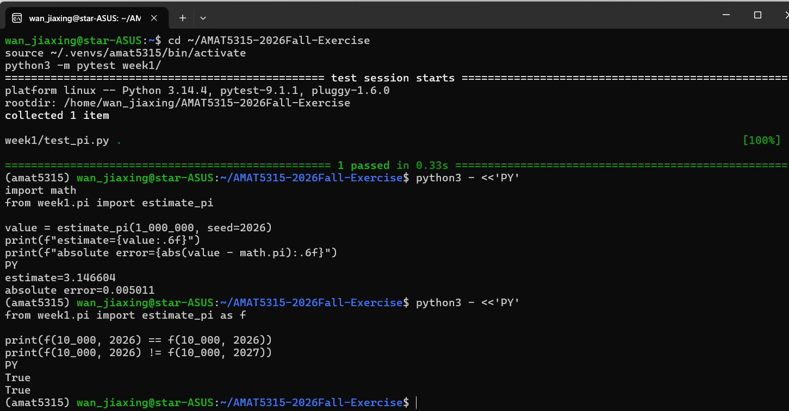

# AMAT5315 Modern Scientific Computing exercises

This repository records weekly coursework in scientific computing, with specifications, code, tests, and numerical evidence that can be checked from the repository root.

## Repository layout

- `week1/` contains a Python Monte Carlo estimator of π, its specification, and a pytest test.
- `week2/` contains a two-dimensional Lennard–Jones molecular-dynamics crate, tests, performance studies, and numerical evidence.
- `week3/` contains a Rust Ising-model simulation, its command design, and a plotting script and figure under `evidence/`.
- `week4/` contains a Rust spectral-flow crate, shared time integrators, experiment scripts, tests, and numerical evidence.

## Environment and dependencies

`setup.txt` records the Python and AI-assisted development environment used for the coursework. The verified Rust toolchain was Rust and Cargo 1.98.1 with support for the 2024 edition. Create a Python environment outside the repository and install the testing and plotting dependencies:

```sh
python3 -m venv ~/.venvs/amat5315
source ~/.venvs/amat5315/bin/activate
python3 -m pip install pytest numpy matplotlib
```

Weeks 2 and 3 use only the Rust standard library. Week 4 declares its Rust dependencies in `week4/Cargo.toml`. Some Week 2 video commands also require FFmpeg on `PATH`. Each weekly specification or README gives the corresponding run, test, and evidence commands.

## Reproduce the Week 1 result

From the repository root, with the virtual environment active, run the test:

```sh
python3 -m pytest week1/
```

Run the seeded estimate and print its absolute error against `math.pi`:

```sh
python3 - <<'PY'
import math
from week1.pi import estimate_pi

estimate = estimate_pi(1_000_000, seed=2026)
print(f"estimate={estimate:.6f}")
print(f"absolute error={abs(estimate - math.pi):.6f}")
PY
```

The verified estimate is **3.146604**, with absolute error **0.005011**. The Week 1 test passes.

## Week 1 evidence


